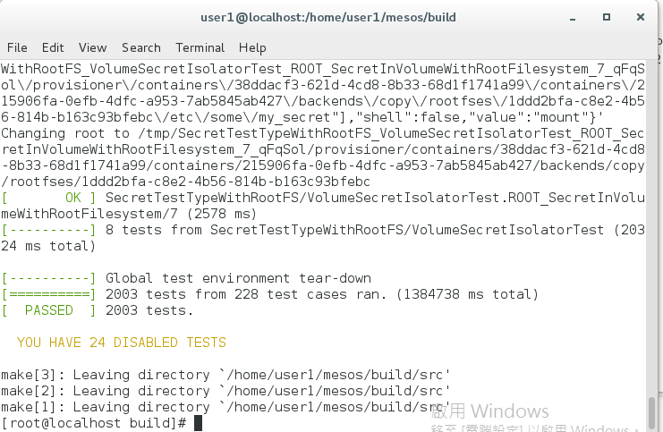

## Runing Mesos Unit Test
### 執行測試程式之前需要做以下的設定
* 關閉 SWAP 指令如下
```
# swapoff -a
```

* 有關於討論關閉 SWAP 的說明在以下的 JIRA 裡 
    * [MESOS-3160](https://issues.apache.org/jira/browse/MESOS-3160)
    * [MESOS-2660](https://issues.apache.org/jira/browse/MESOS-2660)
    
* 需要調整/home下面的使用者權限，指令如下
```
# cd /home
# chmod 755 user1
```
如果沒有做權限的調整在執行測試程式時會發生如下的錯誤
```
[  FAILED  ] bool/UserContainerLoggerTest.ROOT_LOGROTATE_RotateWithSwitchUserTrueOrFalse/0, where GetParam() = true
```

* 安裝 Docker
```
# yum install -y docker
# systemctl enable docker
# systemctl start docker
```

* CPU core 數需要 4 個以上

### 執行測試程式指令如下
```
# make check
```

### 執行完測試之後畫面如下



### 執行單一程式指令測試如下
```
# make test
# cd $MESOS_HOME
# build/bin/mesos-test.sh --gtest_filter="AuthorizationTest*" --verbose
```
