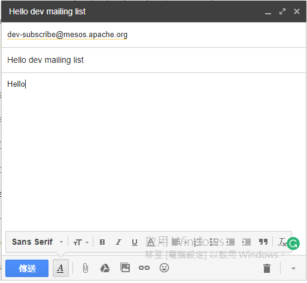
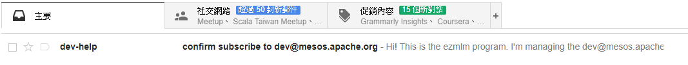
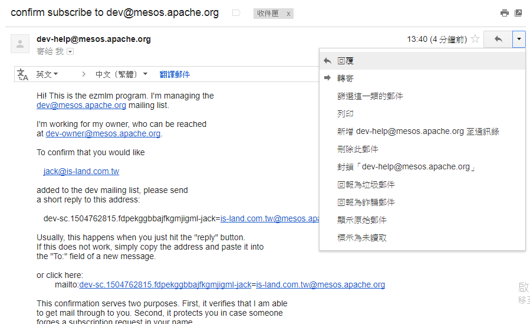
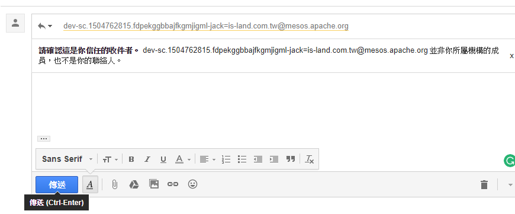
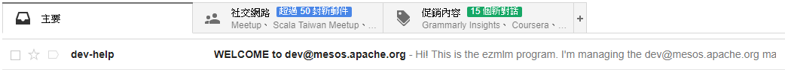
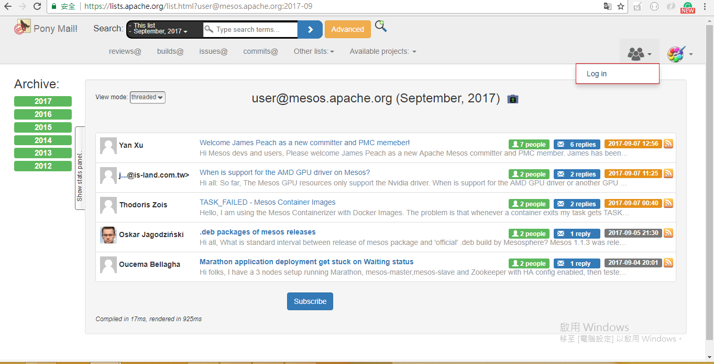
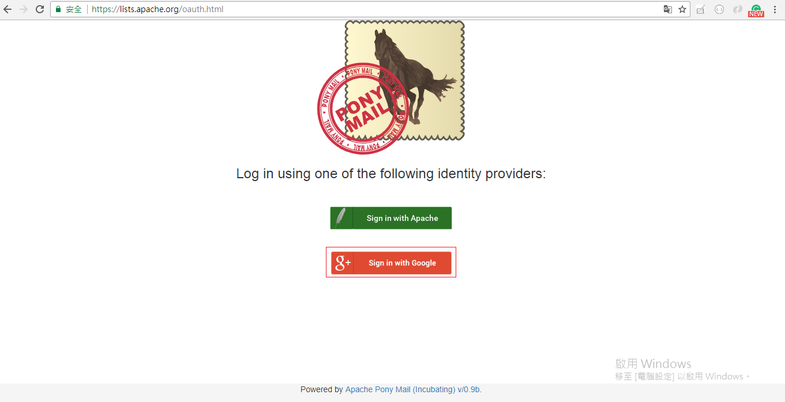
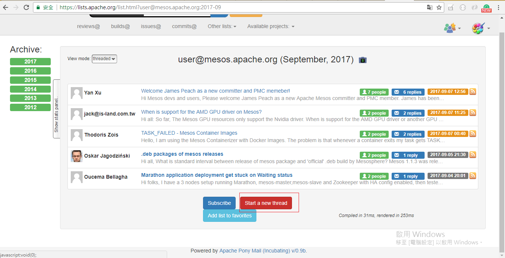

## 如何註冊 Mesos mailing list

### Mesos mailing list 的 Web 網站如下：
* [User](https://lists.apache.org/list.html?user@mesos.apache.org)
* [Developers](https://lists.apache.org/list.html?dev@mesos.apache.org)
* [JIRA](https://lists.apache.org/list.html?issues@mesos.apache.org)
* [Reviews](https://lists.apache.org/list.html?reviews@mesos.apache.org)
* [Commits](https://lists.apache.org/list.html?commits@mesos.apache.org)
* [Modules](http://www.mail-archive.com/modules@mesos.apache.org/)

### 如果要發問須要先訂閱 mailing list, 步驟如下：
#### Step 1: 確認要訂閱類別的 Email 如下
* **User:** user-subscribe@mesos.apache.org
* **Developers:** dev-subscribe@mesos.apache.org
* **JIRA:** issues-subscribe@mesos.apache.org
* **Reviews:** reviews-subscribe@mesos.apache.org
* **Commits:** commits-subscribe@mesos.apache.org
* **Modules:** modules-subscribe@mesos.apache.org

#### Step 2: 寄一封 Email 到訂閱類別的信箱, 如下圖

#### Step 3: 過幾秒會收到一封信, 如下圖

#### Step 4: 進入信裡點擊回覆, 如下圖

#### Step 5: 直接點擊傳送就可以完成訂閱 mailling list, 如下圖

#### Step 6: 完成訂閱會收到信, 如下圖

### 進入 mailing list web 畫面進行發問, 步驟如下：
#### Step 1: Login, 如下圖

### Step 2: 點選 Start a new thread 進行發問, 如下圖

